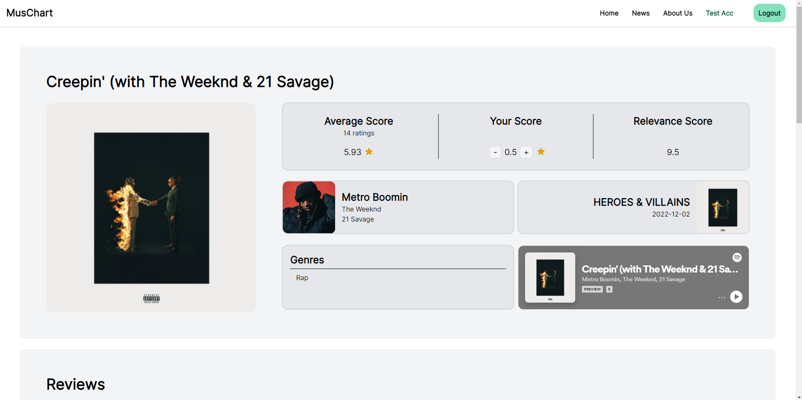

# MusChart

A full stack web application that serves as a music ratings and review website for users.

## Table of Contents

* [Features](#features)
* [Stack](#stack)
* [Project Setup](#project-setup)
* [Project Structure](#project-structure)
* [Contributors](#contributors)

## Features

* Over 80 million songs available via the search bar
  * Supports searching by track, artist or album
* Displays top 10 trending songs on the home page
* Rate a song from 0-10
* Post a written review for a song
* Provides an overview of each song with the following information:
  * Average rating
  * Spotify relevance score
  * Album and artist names
  * Genres
  * Spotify song preview

<br/>




<br/>
<br/>

## Stack

> Node.js v16

_Backend API_

- express.js (v4.18.2)
- sequelize.js (v6.25.2)
- PostgreSQL (v14)
- Passport (v0.6.0)
- Bcrypt (v2.4.3)

_Frontend React client_

- Based on `create-react-app`
  - pre-configured to work with the api
- Tailwind CSS (v3.2.2)
- Flowbite (v1.5.3)
- Flowbite-react (v0.3.4)
- Axios (v1.1.3)
- React Router (v6)

## Project Setup

### Ensure you have PostgreSQL installed

- Check if you have PostgreSQL installed
  - ✅ versions 10-14 should work
  - 🚫 version 15 has not been tested
- If you need to install PostgreSQL see the [installing PostgreSQL guides](https://github.com/CUNYTechPrep/guides#postgresql)

### Create a PostgreSQL user and database

The project-starter template expects the following for local development:

- PostgreSQL User/Role
  - name: `ctp_user`
  - password: `ctp_pass`
- PostgreSQL Database
  - name: `ctp_appdb_development`

#### For Windows/pgAdmin users

If you are on Windows and installed **pgAdmin** follow our [pgAdmin guide](https://github.com/CUNYTechPrep/guides/blob/master/pgAdmin-create-user-db.md) to create a user in PostgreSQL named `ctp_user` with the password `ctp_pass` and a database named `ctp_appdb_development`.

#### For Mac/Linux users

Create a user in PostgreSQL named `ctp_user` with the password `ctp_pass`:

> This only needs to be done one time on your machine
> You can create additional users if you want to.

```
createuser -P -s -e ctp_user
```

Create a separate db for this project:

```
createdb -h localhost -U ctp_user ctp_appdb_development
```

> You will create a DB for each project you start based on this repo. For other projects change `ctp_appdb_development` to the new apps database name.

### Running the app locally

For local development you will need two terminals open, one for the api-backend and another for the react-client.

_Clone_ this app, then:

```bash
# api-backend terminal 1
cp .env.example .env
npm install
npm run dev
```

```bash
# react-client terminal 2
cd client
npm install
npm start
```

- api-backend will launch at: http://localhost:8080
- react-client will launch at: http://localhost:3000


## Project Structure

<pre>
  .
  └── music-app
      ├── api
      │   ├── config
      │   │   └── config.json
      │   ├── controllers
      │   │   ├── auth.js
      │   │   ├── index.js
      │   │   ├── ratings.js
      │   │   └── reviews.js
      │   ├── middlewares
      │   │   └── authentication.js
      │   ├── models
      │   │   ├── index.js
      │   │   ├── Rating.js
      │   │   ├── Review.js
      │   │   ├── Song.js
      │   │   └── User.js
      │   └── app.js
      ├── client
      │   ├── public
      │   │   ├── favicon.ico
      │   │   ├── index.html
      │   │   ├── logo192.png
      │   │   ├── logo512.png
      │   │   ├── manifest.json
      │   │   └── robots.txt
      │   ├── src
      │   │   └── components
      │   │       ├── context
      │   │       │   ├── AuthContext.js
      │   │       │   ├── InfoContext.js
      │   │       │   └── ReviewContext.js
      │   │       ├── hooks
      │   │       │   ├── useAxiosFetchSpotify.js
      │   │       │   └── useGetWinWidth.js
      │   │       ├── layout
      │   │       │   ├── Layout.js
      │   │       │   └── Paging.js
      │   │       ├── UI
      │   │       │   ├── AboutUsProfile.js
      │   │       │   ├── Card.js
      │   │       │   ├── LoadingSpinner.js
      │   │       │   ├── LoadingSpinner.module.css
      │   │       │   ├── NavBarItem.js
      │   │       │   ├── Ratings.js
      │   │       │   ├── ReviewCard.js
      │   │       │   ├── ReviewInputBox.js
      │   │       │   ├── ScoreCard.js
      │   │       │   ├── SongCard.js
      │   │       │   ├── SVG.js
      │   │       │   └── Tooltip.js
      │   │       ├── AuthButton.js
      │   │       ├── ErrorAlert.js
      │   │       ├── MicroPostCard.js
      │   │       ├── ReviewContainer.js
      │   │       ├── SearchBar.js
      │   │       ├── SongInfo.js
      │   │       ├── SongList.js
      │   │       ├── Top10List.js
      │   │       ├── pages
      │   │       │   ├── AboutUSPage.js
      │   │       │   ├── ContactPage.js
      │   │       │   ├── HomePage.js
      │   │       │   ├── LoginPage.js
      │   │       │   ├── PostFormPage.js
      │   │       │   ├── PostsListPage.js
      │   │       │   ├── SearchResultListPage.js
      │   │       │   ├── ShowPostPage.js
      │   │       │   ├── SignupPage.js
      │   │       │   └── SongDetailsPage.js
      │   │       ├── App.js
      │   │       ├── index.css
      │   │       └── index.js
      │   ├── package-lock.json
      │   ├── package.json
      │   ├── README.md
      │   └── tailwind.config.js
      ├── package-lock.json
      ├── package.json
      └── README.md
</pre>

## Contributors

- [Tianye Chen](https://github.com/tianye-chen)
- [John Soto](https://github.com/Soto-J/)
- [Norik Zhagui](https://github.com/Norikaz)
- [John Alban](https://github.com/JohnA28)
